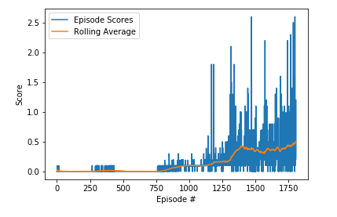

# Project Report - Collaboration and Competition

## Learning algorithm

The learning algorithm used is Deep Deterministic Policy Gradients (DDPG) with each agent possessing a different network. <br/>
The algorithm consists of 2 seperate agents each with set of 2 neural networks - actor and critic. <br/>
The actor network takes observation as an input and outputs actions.  <br/>
The critic network is used to compute state-action values. It outputs 1 real number - state value estimate for the given agent's actions and local observations for the agent as input. <br/>

### The DDPG algorithm works as follows:


## Parameters and hyperparameters

### Neural networks

#### Actor network

- 2 fully connected hidden layers
- 24 input nodes [observation vector size for single agent], 2 output nodes [action vector size]
- 400 hidden nodes in first layer and 300 in second layer
- ReLU activations, tanh on last layer
- Learning rate `1e-4`
- OUNoise applied to final action output to promote exploration

#### Critic network

- 2 fully connected hidden layers
- 26 input nodes [observation vector size + action vector size], 1 output node
- Observation vector [size 24] connected to 400-sized hidden layer
- Output of first hidden layer, concatenated with action vector, and connected to 300-sized hidden layer
- Second hidden layer finally connected to one output node
- ReLU activations, no activation on last layer
- Learning rate `1e-3`

### Main hyperparameters

- Discount Factor, Gamma - `0.995`
- Soft Update Rate, Tau - `1e-3`
- Buffer size - `1e6`
- Batch size - `1024`
- Update frequency - `20`
- Optimizer - `Adam`
- L2 Weight Decay - `1e-6`


## Results



The chart above shows an average reward over 100 consecutive episodes.<br/>
It's very flat until 1000 episodes and then it explodes. The agent reaches higher values via cooperation.<br/>
The agent reaches the level required for considering environment solved in 1706 episodes.<br/>
This is a gif of the trained agent playing. Complete video is available [here](/Videos/Agent.mov)


## Future Work

### 1. Hyperparameter Tuning
The current networks make a sharp decline from 300 perceptrons in the penultimate layer to just 1 for critic and 2 for agent. It might be better to use a less stark decline. <br/>
While training, I saw that sometimes the agent starts learning quite early on, say in 400 episodes, while in other cases, it learnt nothing until 1100 episodes. However, by 2000 episodes it almost always reached the target score of 0.5. It would be worthwhile to plot the success rate with number of episodes the agent is run, as a measure for how stable the learner is. <br/>
Can also try adding noise to network parameters rather than adding to final action output.

### 2. Parallelization
Learning can be made much faster if we could parallelly run multiple instances of the environment. <br/>
However, the Unity Environment given to us is not able to support multiple parallel environment instantiations. <br/>
I might need to create a new Unity Environment which supports parallelization.

### 3. MADDPG
I used DDPG for each agent. The issue with this is that the environment becomes non-stationary as both agents learn and the markov assumptions break down. MADDPG could provide a better learner.

### 4. Playing against humans
This agent learns via self-play and thus should be really good to play against an agent that plays like itself, but might not be good enough to tackle different opponent strategies. <br/>
These agents learn in an almost semi-cooperative way, both being able to score higher if they give each other easy points. <br/>
This unity environment allows for a human player as 'MyBrain'. MADDPG allows us to use estimators for opponent policies.<br/>
It would be really interesting to implement MADDPG with opponent estimators and watch it learn online against a human.

### 5. Trying it on other environments
Soccer environment sounds like a good idea to tackle.


```python

```
